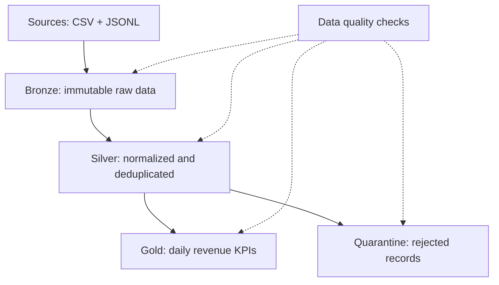

# LakeQuality — Datalake Reservations

**Personal Data Test Engineering simulation / Simulation personnelle de Data Test Engineering**

> **EN** — Personal simulation project created for interview preparation from public mission descriptions. All data is synthetic. This project does not reproduce the architecture, data, tools, or internal methods of Sopra Steria, Nooeh, or any of their clients.
>
> **FR** — Projet personnel de simulation réalisé pour préparer un entretien à partir de descriptifs de mission publics. Toutes les données sont synthétiques. Ce projet ne reproduit ni l’architecture, ni les données, ni les outils, ni les méthodes internes de Sopra Steria, de Nooeh ou de leurs clients.

## Simulated mission / Mission simulée

**EN** — Qualify version 1.1 of an incremental reservations pipeline before production release:

- define an end-to-end test strategy;
- automate critical integration and data-quality checks;
- verify cross-system flows between bookings, payments, and offers;
- measure a reproducible batch-performance baseline;
- integrate a quality gate into CI/CD;
- produce a quality assessment and a GO/NO-GO recommendation;
- optionally propose and execute a Kubernetes batch job.

**FR** — Qualifier la version 1.1 d’un pipeline incrémental de réservations avant sa mise en production :

- définir une stratégie de tests de bout en bout ;
- automatiser les contrôles critiques d’intégration et de qualité des données ;
- vérifier les flux transverses entre réservations, paiements et offres ;
- mesurer une baseline reproductible de performance batch ;
- intégrer un quality gate dans la CI/CD ;
- produire un bilan qualité et une recommandation GO/NO-GO ;
- proposer et, si possible, exécuter un batch sous Kubernetes.

## Data flow / Flux de données



## Laboratory stack / Stack du laboratoire

- Python 3.14 (local and CI target / cible locale et CI) ;
- Python, pandas, DuckDB, SQL;
- CSV, JSONL, and Parquet / CSV, JSONL et Parquet ;
- pytest with HTML and JUnit reports / pytest avec rapports HTML et JUnit ;
- Git, GitHub Actions, and an optional GitLab CI execution / Git, GitHub Actions et une exécution GitLab CI optionnelle ;
- reproducible batch-performance measurements / mesures reproductibles de performance batch ;
- optional Kubernetes Job, documented as executed only if it is actually run / Job Kubernetes optionnel, déclaré exécuté uniquement s’il est réellement lancé.

DuckDB is a reproducible local SQL engine for this laboratory. It does not claim to reproduce a client platform.

DuckDB est utilisé comme moteur SQL local reproductible. Il ne prétend pas reproduire la plateforme d’un client.

## Evidence rule / Règle de preuve

Every portfolio element is classified as / Chaque élément du portfolio est classé comme :

1. **Actually executed / Réellement exécuté** — command, test, or query executed and verified.
2. **Simulation assumption / Hypothèse de simulation** — invented business rule, threshold, or volume.
3. **Proposed extension / Extension proposée** — design element not executed and clearly labelled as such.

## Documentation

| Audience | English | Français | Polski — nauka |
|---|---|---|---|
| Mission brief | `docs/portfolio/en/01_mission_brief_EN.md` | `docs/portfolio/fr/01_mission_brief_FR.md` | `docs/learning/pl/00_opis_projektu_PL.md` |
| Acceptance criteria | `docs/portfolio/en/02_acceptance_criteria_EN.md` | `docs/portfolio/fr/02_criteres_acceptation_FR.md` | explained by the tutor / wyjaśniane przez tutora |
| Risk analysis | `docs/portfolio/en/03_risk_coverage_EN.md` | `docs/portfolio/fr/03_risques_et_couverture_FR.md` | explained by the tutor / wyjaśniane przez tutora |
| Execution plan | `docs/portfolio/en/04_execution_plan_EN.md` | `docs/portfolio/fr/04_plan_execution_FR.md` | `docs/learning/pl/01_metoda_nauki_PL.md` |
| Data contract | `docs/portfolio/en/05_data_contract_EN.md` | `docs/portfolio/fr/05_contrat_donnees_FR.md` | explained during SQL work / objaśniany przy SQL |
| Evidence register | `docs/portfolio/en/06_evidence_register_EN.md` | `docs/portfolio/fr/06_registre_preuves_FR.md` | screen guidance in each lesson / instrukcje w lekcjach |
| Day 1 tutorial | — | — | `docs/learning/pl/02_day1_tutorial_macOS_PL.md` |

## Quick start / Démarrage rapide

```bash
python3 -m venv .venv
source .venv/bin/activate
python -m pip install -r requirements.txt
python -m src.generate_data --rows 1000
python -m src.pipeline --mode fixed
python -m pytest -q
```

The controlled `buggy` mode is reserved for the documented BUG-001 cycle.

Le mode contrôlé `buggy` est réservé au cycle documenté BUG-001.

The dependency set was updated after environment preflight EV-001 identified Python 3.14 on the target macOS workstation. The updated set passed the complete 10-test regression suite before release.

Les dépendances ont été mises à jour après que le preflight EV-001 a identifié Python 3.14 sur le poste macOS cible. Le nouvel ensemble a réussi la régression complète de 10 tests avant publication.
